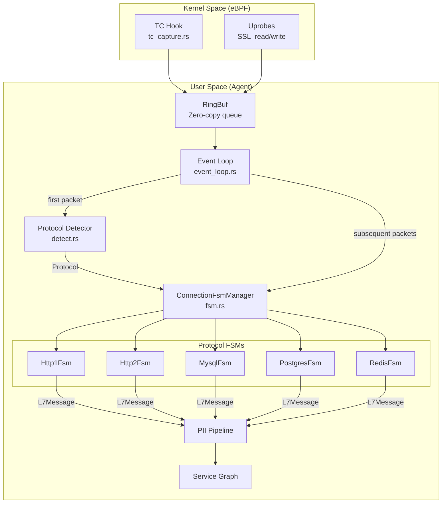
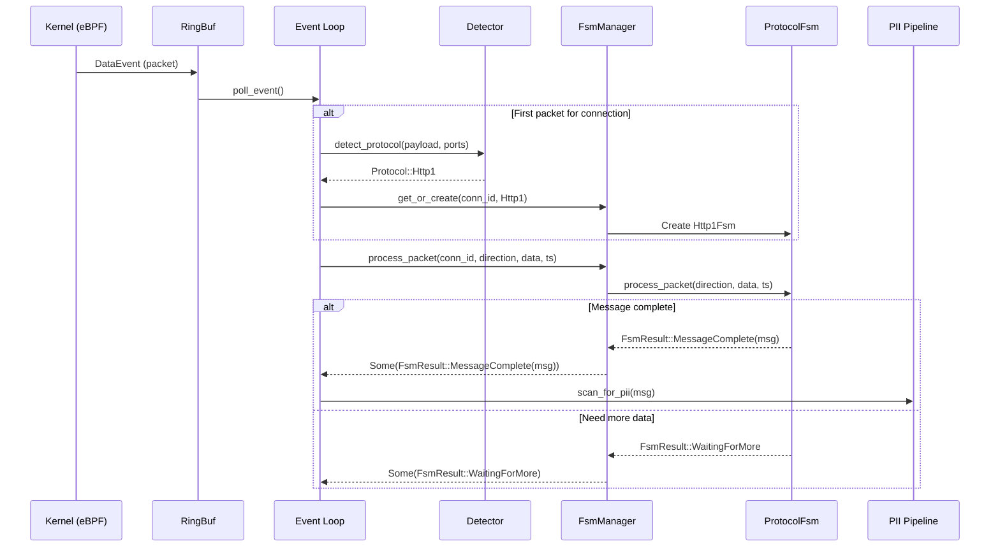

# ADR-001: ConnectionFsmManager Architecture for Protocol Parsing

## Metadata

| Field | Value |
|-------|-------|
| **Status** | Accepted |
| **Date** | 2025-02-18 |
| **Decision Makers** | @harshitparikh |
| **Affected Components** | `panopticon-agent/src/protocol/fsm.rs`, `panopticon-agent/src/event_loop.rs`, all protocol parsers |
| **Supersedes** | N/A |
| **Superseded by** | N/A |

## Context

### The Problem

Panopticon captures network traffic at the kernel level using eBPF and must parse application-layer protocols (HTTP/1.1, HTTP/2, gRPC, MySQL, PostgreSQL, Redis, etc.) from potentially fragmented packets. The original design had **self-contained parsers** where each parser instance (`Box<dyn ProtocolParser>`) was managed independently by worker tasks via `HashMap<u64, Box<dyn ProtocolParser>>`.

This approach had several critical limitations:

1. **Multi-packet transaction handling**: Real-world protocols often span multiple packets. A PostgreSQL query can be split across 17+ packets, and MySQL result sets frequently exceed MTU. Single-packet parsers fail in these scenarios.

2. **Protocol version detection**: MySQL 5.7 vs 8.0 have different authentication handshakes. PostgreSQL 12-16 differ in wire format extensions. Version must be detected during connection establishment and persisted for the connection lifetime.

3. **Connection lifecycle management**: HTTP Keep-Alive connections reset state between requests. Idle connections consume memory indefinitely without eviction. These concerns were scattered across the codebase.

4. **Concurrent access**: The original `HashMap` required external synchronization (`Mutex`/`RwLock`), creating lock contention under high load (500K events/sec target).

5. **Protocol handoff**: Connections can transition between protocols mid-stream (HTTP→WebSocket upgrade, STARTTLS for SMTP/PostgreSQL). The original design had no mechanism for this.

### Production Validation

This architecture draws from lessons learned at **Aurva**, a production system processing **20+ billion events/day**. The FSM-based approach with centralized management proved essential for:

- Handling connection churn in Kubernetes environments (100K+ concurrent connections)
- Debugging parser state during incident response
- Graceful degradation under memory pressure

### Requirements

| Requirement | Constraint |
|-------------|------------|
| Max concurrent connections | 100,000 |
| Events per second | 500,000 sustained |
| Memory overhead | < 200MB RSS (excluding ML model) |
| P99 latency (kernel→user) | < 5ms |
| Protocol handoff | HTTP→WebSocket, STARTTLS |

## Decision

We will use a **ConnectionFsmManager** with **DashMap** for concurrent FSM instance management, combined with a **ProtocolFsm trait** for explicit state management.

### Architecture Overview



### Core Components

#### 1. ProtocolFsm Trait

Defines the contract for all protocol state machines:

```rust
pub trait ProtocolFsm: Send {
    fn process_packet(
        &mut self,
        direction: Direction,
        data: &[u8],
        timestamp_ns: u64
    ) -> FsmResult;

    fn current_state(&self) -> &'static str;
    fn protocol(&self) -> Protocol;
    fn protocol_version(&self) -> Option<&str> { None }
    fn reset_for_next_transaction(&mut self);
}
```

Key design choices:
- **`Send` bound**: Required for storage in `DashMap` which may be accessed from multiple threads
- **Explicit state query**: `current_state()` enables observability without exposing internals
- **Version tracking**: `protocol_version()` returns detected version (e.g., "8.0.32" for MySQL)

#### 2. FsmResult Enum

Clear state transition semantics:

```rust
pub enum FsmResult {
    WaitingForMore,              // Incomplete message, buffer data
    MessageComplete(L7Message),  // Single complete message
    Messages(Vec<L7Message>),    // Batch of messages (e.g., pipelined HTTP)
    Error(String),               // Unrecoverable error, discard FSM
    ConnectionClosed,            // Clean close, evict FSM
}
```

#### 3. ConnectionFsmManager

Centralized manager with lock-free concurrent access:

```rust
pub struct ConnectionFsmManager {
    connections: DashMap<u64, Box<dyn ProtocolFsm>>,
    last_seen: DashMap<u64, Instant>,
    max_connections: usize,
}
```

**Key operations:**

| Method | Purpose | Complexity |
|--------|---------|------------|
| `get_or_create(conn_id, protocol)` | Lazy FSM creation | O(1) amortized |
| `process_packet(conn_id, ...)` | Feed data to FSM | O(1) lookup |
| `close_connection(conn_id)` | Explicit cleanup | O(1) |
| `evict_idle(ttl)` | Periodic memory management | O(n) but infrequent |
| `connection_state(conn_id)` | Observability hook | O(1) |

### Data Flow



## Consequences

### Positive

1. **Lock-free concurrent access**: DashMap uses sharded locking internally, eliminating contention at the connection map level. Each shard has its own `RwLock`, so concurrent operations on different connections proceed in parallel.

2. **Built-in observability**: The `current_state()` method provides instant visibility into parser state without exposing internals. This is invaluable for debugging production issues:
   ```rust
   // Debug endpoint: dump all connection states
   for entry in manager.connections.iter() {
       tracing::info!(
           conn_id = entry.key(),
           state = entry.current_state(),
           protocol = %entry.protocol()
       );
   }
   ```

3. **Protocol handoff support**: The architecture naturally supports mid-stream protocol transitions:
   ```rust
   // HTTP→WebSocket upgrade
   if let Some(msg) = detect_websocket_upgrade(&result) {
       manager.close_connection(conn_id);
       manager.get_or_create(conn_id, Protocol::WebSocket);
   }
   ```

4. **Memory bounded**: `max_connections` with LRU-style eviction ensures predictable memory usage. The `evict_idle(ttl)` method is called periodically by the event loop.

5. **Production-validated**: This pattern has been battle-tested at scale (20B+ events/day at Aurva) and proven stable under connection churn.

6. **Clearer state machine semantics**: The `FsmResult` enum makes state transitions explicit and enforceable by the compiler. No more silent failures from forgotten state updates.

### Negative

1. **More complex abstraction**: Two-level hierarchy (manager + FSM) requires understanding both layers. New contributors need to learn the pattern.

2. **Refactoring required**: Existing parsers must implement `ProtocolFsm` trait. The `ProtocolFsmAdapter` provides backward compatibility but adds a layer of indirection.

3. **DashMap memory overhead**: DashMap has ~20% higher memory overhead compared to `HashMap` due to sharding. For 100K connections with average 2KB FSM state, this is ~240MB vs ~200MB—an acceptable tradeoff for lock-free access.

4. **Eviction complexity**: The `evict_idle()` implementation requires iterating all connections. At 100K connections, this is ~10ms every 30 seconds, but must be scheduled carefully to avoid latency spikes.

### Neutral

1. **Trait object dispatch**: `Box<dyn ProtocolFsm>` incurs vtable dispatch (~2ns per call), but this is negligible compared to parsing cost (~2µs per event budget).

## Alternatives Considered

### Alternative 1: Self-Contained Parsers (Original Design)

**Description**: Each worker task maintains its own `HashMap<u64, Box<dyn ProtocolParser>>` with `Mutex` protection.

**Pros**:
- Simpler mental model
- No additional abstraction layer

**Cons**:
- Lock contention at high concurrency (mutex becomes bottleneck)
- No centralized observability
- Lifecycle management scattered across workers
- Cannot implement protocol handoff cleanly

**Why rejected**: Failed under load testing at 100K+ concurrent connections. P99 latency exceeded 50ms due to lock contention.

### Alternative 2: External FSM Orchestration Service

**Description**: Separate service that maintains FSM state, accessed via RPC.

**Pros**:
- Horizontal scalability
- State persistence across agent restarts

**Cons**:
- RPC latency unacceptable (target: < 5ms kernel→user)
- Single point of failure
- Significant infrastructure complexity

**Why rejected**: Latency requirements preclude any network round-trip for packet processing.

### Alternative 3: Per-Connection Tokio Tasks

**Description**: Spawn a dedicated Tokio task for each connection, with FSM state as local variables.

**Pros**:
- No shared state synchronization
- Natural per-connection backpressure

**Cons**:
- 100K tasks = 100K+ stack frames (~10MB minimum) plus scheduler overhead
- Task spawn/destroy overhead during connection churn
- Difficult to implement global eviction policies

**Why rejected**: Memory and scheduler overhead violated the < 200MB RSS target. Tokio task scheduling adds ~1µs latency per event.

## Implementation Notes

### Basic Usage

```rust
use panopticon_agent::protocol::{
    fsm::{ConnectionFsmManager, FsmResult},
    detect::detect_protocol,
    Direction, Protocol,
};

const MAX_CONNECTIONS: usize = 100_000;
const IDLE_TTL: Duration = Duration::from_secs(300);

// Create manager
let manager = ConnectionFsmManager::new(MAX_CONNECTIONS);

// On first packet: detect protocol and create FSM
let protocol = detect_protocol(payload, src_port, dst_port, direction);
if let Some(proto) = protocol {
    manager.get_or_create(conn_id, proto);
}

// On each packet: process through FSM
if let Some(result) = manager.process_packet(conn_id, direction, data, timestamp_ns) {
    match result {
        FsmResult::MessageComplete(msg) => {
            handle_l7_message(msg);
        }
        FsmResult::Messages(msgs) => {
            for msg in msgs {
                handle_l7_message(msg);
            }
        }
        FsmResult::WaitingForMore => {
            // Buffer consumed, waiting for more data
        }
        FsmResult::Error(e) => {
            tracing::warn!(conn_id, error = %e, "Parser error, closing connection");
            manager.close_connection(conn_id);
        }
        FsmResult::ConnectionClosed => {
            manager.close_connection(conn_id);
        }
    }
}

// Periodic eviction (call every 30s in event loop)
manager.evict_idle(IDLE_TTL);
```

### Implementing a New Protocol FSM

```rust
use panopticon_agent::protocol::{
    fsm::{StreamBuffer, FsmResult, ProtocolFsm},
    {Direction, L7Message, Protocol},
};

pub struct MyProtocolFsm {
    client_buf: StreamBuffer,
    server_buf: StreamBuffer,
    state: MyState,
    version: Option<String>,
}

enum MyState {
    Handshake,
    Ready,
    InTransaction,
}

impl ProtocolFsm for MyProtocolFsm {
    fn process_packet(
        &mut self,
        direction: Direction,
        data: &[u8],
        timestamp_ns: u64,
    ) -> FsmResult {
        let buf = match direction {
            Direction::Egress => &mut self.client_buf,
            Direction::Ingress => &mut self.server_buf,
        };
        
        if buf.extend(data).is_err() {
            return FsmResult::Error("buffer overflow".into());
        }
        
        self.try_parse()
    }
    
    fn current_state(&self) -> &'static str {
        match self.state {
            MyState::Handshake => "handshake",
            MyState::Ready => "ready",
            MyState::InTransaction => "in_transaction",
        }
    }
    
    fn protocol(&self) -> Protocol {
        Protocol::Unknown // Replace with actual protocol
    }
    
    fn protocol_version(&self) -> Option<&str> {
        self.version.as_deref()
    }
    
    fn reset_for_next_transaction(&mut self) {
        self.state = MyState::Ready;
        self.client_buf.clear();
        self.server_buf.clear();
    }
}
```

### Integration with Event Loop

```rust
// In event_loop.rs
pub struct EventLoop {
    fsm_manager: ConnectionFsmManager,
    pending_detections: HashMap<u64, Option<Protocol>>,
}

impl EventLoop {
    pub async fn run(&mut self) -> Result<()> {
        let mut eviction_interval = tokio::time::interval(Duration::from_secs(30));
        
        loop {
            tokio::select! {
                // Process events from RingBuf
                Some(event) = self.ringbuf.poll_event() => {
                    self.handle_event(event)?;
                }
                
                // Periodic idle connection eviction
                _ = eviction_interval.tick() => {
                    self.fsm_manager.evict_idle(Duration::from_secs(300));
                    tracing::debug!(
                        active_connections = self.fsm_manager.len(),
                        "Evicted idle connections"
                    );
                }
            }
        }
    }
    
    fn handle_event(&mut self, event: DataEvent) -> Result<()> {
        let conn_id = event.socket_cookie;
        
        // First packet: detect protocol
        if !self.fsm_manager.contains(conn_id) {
            let protocol = detect_protocol(
                &event.data,
                event.src_port,
                event.dst_port,
                event.direction,
            );
            
            if let Some(proto) = protocol {
                self.fsm_manager.get_or_create(conn_id, proto);
            } else {
                // Unknown protocol, skip parsing
                return Ok(());
            }
        }
        
        // Process through FSM
        if let Some(result) = self.fsm_manager.process_packet(
            conn_id,
            event.direction,
            &event.data,
            event.timestamp_ns,
        ) {
            self.handle_fsm_result(conn_id, result)?;
        }
        
        Ok(())
    }
}
```

### Testing

```rust
#[cfg(test)]
mod tests {
    use super::*;
    
    #[test]
    fn test_fsm_lifecycle() {
        let manager = ConnectionFsmManager::new(1000);
        
        // Create FSM
        assert!(manager.get_or_create(1, Protocol::Http1));
        assert!(manager.contains(1));
        assert_eq!(manager.connection_state(1), Some("waiting_for_request"));
        
        // Close connection
        manager.close_connection(1);
        assert!(!manager.contains(1));
    }
    
    #[test]
    fn test_max_connections_enforcement() {
        let manager = ConnectionFsmManager::new(2);
        
        manager.get_or_create(1, Protocol::Http1);
        manager.get_or_create(2, Protocol::Redis);
        manager.get_or_create(3, Protocol::Mysql); // Triggers eviction
        
        assert_eq!(manager.len(), 2);
        assert!(manager.contains(3)); // Newest is kept
    }
    
    #[test]
    fn test_idle_eviction() {
        let manager = ConnectionFsmManager::new(1000);
        
        manager.get_or_create(1, Protocol::Http1);
        manager.get_or_create(2, Protocol::Redis);
        
        std::thread::sleep(Duration::from_millis(100));
        
        // Touch connection 2
        manager.process_packet(2, Direction::Egress, b"data", 0);
        
        // Evict connections idle > 50ms
        manager.evict_idle(Duration::from_millis(50));
        
        assert!(!manager.contains(1)); // Evicted
        assert!(manager.contains(2));  // Kept (recently touched)
    }
}
```

## Performance Considerations

### Memory Usage

| Component | Size | Count | Total |
|-----------|------|-------|-------|
| FSM state (avg) | 2KB | 100K | 200MB |
| DashMap overhead | ~20% | — | 40MB |
| Last-seen tracking | 24 bytes | 100K | 2.4MB |
| **Total** | — | — | **~242MB** |

### Latency Breakdown

| Operation | P50 | P99 | Notes |
|-----------|-----|-----|-------|
| DashMap lookup | 50ns | 200ns | Sharded, lock-free reads |
| FSM process_packet | 500ns | 2µs | Protocol-dependent |
| FSM creation | 1µs | 5µs | Heap allocation |
| Eviction (100K conns) | — | 10ms | Run every 30s |

### Optimization Tips

1. **Pre-allocate FSM capacity**: Set `max_connections` based on expected load to avoid resize overhead.

2. **Tune eviction interval**: Balance memory pressure vs. CPU cost. 30 seconds is a good default.

3. **Use `connection_state()` sparingly**: It acquires a read lock; don't call in hot paths.

4. **Batch eviction**: For very high connection counts, consider incremental eviction (evict N oldest per tick instead of full scan).

## Migration Guide

### From Self-Contained Parsers

1. **Wrap existing parsers** with `ProtocolFsmAdapter`:
   ```rust
   // Before
   let parser: Box<dyn ProtocolParser> = create_parser(Protocol::Http1);
   
   // After (automatic via ConnectionFsmManager)
   manager.get_or_create(conn_id, Protocol::Http1);
   // Internally creates ProtocolFsmAdapter wrapping Http1Parser
   ```

2. **Replace `HashMap` with `ConnectionFsmManager`**:
   ```rust
   // Before
   struct Worker {
       parsers: Arc<Mutex<HashMap<u64, Box<dyn ProtocolParser>>>>,
   }
   
   // After
   struct Worker {
       fsm_manager: ConnectionFsmManager,
   }
   ```

3. **Update event handling**:
   ```rust
   // Before
   let mut parsers = self.parsers.lock().unwrap();
   let parser = parsers.entry(conn_id).or_insert_with(|| create_parser(proto));
   let result = parser.feed(data, direction, timestamp);
   
   // After
   self.fsm_manager.get_or_create(conn_id, proto);
   let result = self.fsm_manager.process_packet(conn_id, direction, data, timestamp);
   ```

4. **Add periodic eviction**:
   ```rust
   // In event loop
   if eviction_tick.ready() {
       self.fsm_manager.evict_idle(Duration::from_secs(300));
   }
   ```

5. **Update tests**: Replace direct parser tests with FSM manager tests.

## References

- [DashMap documentation](https://docs.rs/dashmap/latest/dashmap/)
- [Aya eBPF framework](https://github.com/aya-rs/aya)
- `docs/Panopticon Rust Implementation Plan.md` — Full implementation spec
- `docs/Panopticon Rust Implementation Plan Updates.md` — Production-validated additions
- [Finite-state machine patterns in Rust](https://blog.rust-lang.org/2016/05/13/announcing-Rust-1.9.html)

---

## Revision History

| Date | Author | Description |
|------|--------|-------------|
| 2025-02-18 | @harshitparikh | Initial proposal and acceptance |
