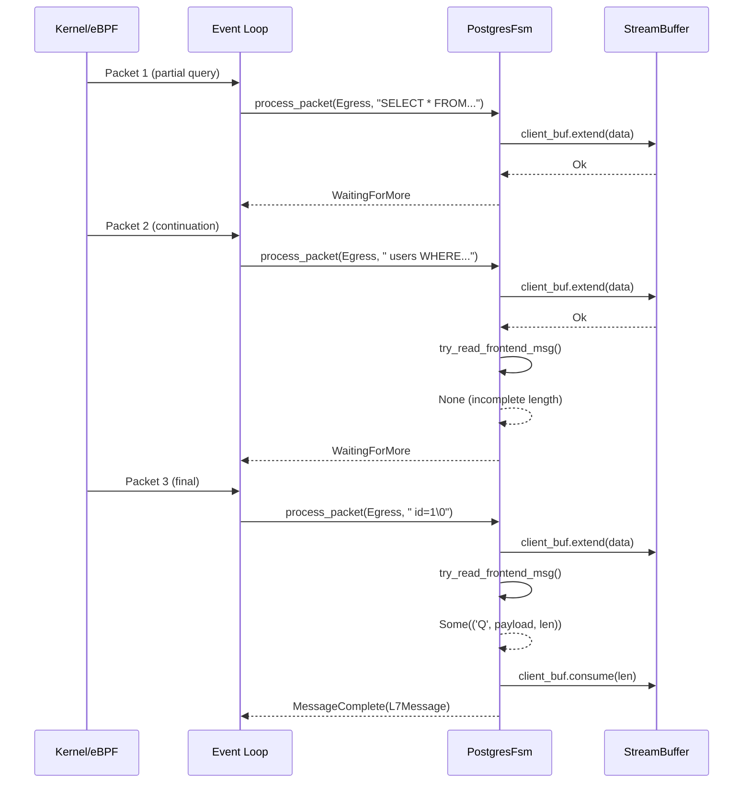

# ADR-003: PostgreSQL Multi-Packet Query Handling

## Metadata

| Field | Value |
|-------|-------|
| **Status** | Accepted |
| **Date** | 2026-02-18 |
| **Decision Makers** | @panopticon-team |
| **Affected Components** | `panopticon-agent/src/protocol/postgres.rs`, `panopticon-agent/src/protocol/fsm.rs` |
| **Supersedes** | N/A |
| **Superseded by** | N/A |

## Context

### The Problem

PostgreSQL's wire protocol presents unique challenges for packet-level observability systems like Panopticon. Unlike protocols with explicit message boundaries (e.g., HTTP with Content-Length headers), PostgreSQL messages can be arbitrarily large and span multiple TCP packets.

**Key challenges:**

1. **No Explicit Message Boundaries**: PostgreSQL uses a length-prefixed format where message boundaries are determined by parsing the length field, not by packet boundaries. A single logical message can span many packets.

2. **Large Query Support**: Real-world workloads frequently include:
   - `INSERT` statements with thousands of rows
   - Complex analytical `SELECT` queries with numerous joins
   - `COPY` operations with bulk data
   - Prepared statement batches

3. **Authentication Multi-Round-Trip**: The authentication phase requires multiple round-trips between client and server, with different message types at each stage (MD5, SCRAM-SHA-256, GSSAPI, etc.).

4. **Connection State Dependency**: Each connection has its own state machine that must be maintained across all packets—startup, authentication, query execution, and termination.

### Production Evidence

At scale, multi-packet queries are common:

| Query Type | Typical Packets | Example |
|------------|-----------------|---------|
| Simple SELECT | 1-2 | `SELECT * FROM users WHERE id = 1` |
| Complex JOIN | 3-8 | Multi-table analytical queries |
| Bulk INSERT | 10-50+ | `INSERT INTO logs VALUES (...), (...)` |
| COPY command | 100+ | Bulk data import |

A single 64KB PostgreSQL message (common for large queries) requires ~44 packets on a 1500-byte MTU network.

### Requirements

| Requirement | Constraint |
|-------------|------------|
| Max message size | 1GB (PostgreSQL limit) |
| Buffer size limit | 256KB per direction (configurable) |
| Packet processing latency | < 2µs per packet |
| Memory overhead | < 2KB per idle connection |
| State visibility | Debug access to current FSM state |

## Decision

We will use a **PostgresFsm** with explicit states and per-direction **StreamBuffer** instances to accumulate data across packets. Each connection gets its own FSM instance managed by `ConnectionFsmManager`.

### State Machine Design

```
                    ┌──────────────────────┐
                    │  WaitingForStartup   │
                    └──────────┬───────────┘
                               │ StartupMessage received
                               ▼
                    ┌──────────────────────┐
                    │       InAuth         │
                    └──────────┬───────────┘
                               │ ReadyForQuery ('Z')
                               ▼
               ┌───────────────┴───────────────┐
               │            Ready              │
               └───────────────┬───────────────┘
                               │
          ┌────────────────────┼────────────────────┐
          │                    │                    │
          ▼                    ▼                    ▼
   ┌──────────────┐   ┌────────────────┐   ┌──────────────┐
   │InSimpleQuery │   │ InExtendedQuery│   │   InCopy     │
   └──────┬───────┘   └───────┬────────┘   └──────┬───────┘
          │                   │                   │
          │                   ▼                   │
          │           ┌────────────────┐          │
          │           │  InResponse    │◄─────────┘
          │           └───────┬────────┘
          │                   │ ReadyForQuery ('Z')
          └───────────────────┤
                              ▼
                    ┌──────────────────────┐
                    │        Ready         │
                    └──────────┬───────────┘
                               │ Terminate ('X')
                               ▼
                    ┌──────────────────────┐
                    │    ConnectionClosed  │
                    └──────────────────────┘
```

### Wire Format Handling

PostgreSQL wire protocol has three message formats:

#### 1. StartupMessage (Client → Server, first message)

```
┌──────────────┬──────────────┬─────────────────┐
│ Length (4B)  │ Protocol (4B)│ Parameters      │
│ BE u32       │ 196608=v3.0  │ "user\0val\0..."│
└──────────────┴──────────────┴─────────────────┘
```

**No message type byte**—distinguished by being the first message on the connection.

#### 2. BackendMessage (Server → Client)

```
┌──────────────┬──────────────┬─────────────────┐
│ Type (1B)    │ Length (4B)  │ Payload         │
│ 'R','S','T'..│ BE u32       │ type-specific   │
└──────────────┴──────────────┴─────────────────┘
```

Common types:
- `R` = Authentication
- `S` = ParameterStatus
- `T` = RowDescription
- `D` = DataRow
- `C` = CommandComplete
- `Z` = ReadyForQuery
- `E` = ErrorResponse

#### 3. FrontendMessage (Client → Server)

```
┌──────────────┬──────────────┬─────────────────┐
│ Type (1B)    │ Length (4B)  │ Payload         │
│ 'Q','P','B'..│ BE u32       │ type-specific   │
└──────────────┴──────────────┴─────────────────┘
```

Common types:
- `Q` = Query (simple)
- `P` = Parse (prepared statement)
- `B` = Bind
- `E` = Execute
- `X` = Terminate

### Multi-Packet Flow Example

A large query spanning 17 packets:

```
Packet 1 (1500B):  "SELECT * FROM users WHERE"
                   └─ Incomplete, buffer and wait

Packet 2 (1500B):  " id IN (1, 2, 3, 4, 5, 6"
                   └─ Append to buffer, still incomplete

Packet 3 (1500B):  ", 7, 8, 9, 10) AND status"
                   └─ Append to buffer, still incomplete

...

Packet 16 (1500B): " = 'active' AND created_a"
                    └─ Append to buffer, still incomplete

Packet 17 (512B):  "t > '2024-01-01'\0"
                   └─ Null terminator found!
                   └─ Total length field = 25472
                   └─ Complete message parsed
                   └─ State: Ready → InSimpleQuery
                   └─ L7Message emitted with query text
```

### Buffer Management

Each connection maintains two `StreamBuffer` instances:

```rust
pub struct PostgresParser {
    client_buf: StreamBuffer,  // Egress (frontend messages)
    server_buf: StreamBuffer,  // Ingress (backend messages)
    // ...
}
```

**Buffer lifecycle:**



## Consequences

### Positive

1. **Correct Multi-Packet Handling**: Large queries spanning dozens of packets are correctly reassembled before parsing. No truncated queries in logs.

2. **Memory Bounded**: `StreamBuffer` enforces a 256KB limit per direction. Oversized messages return an error rather than causing OOM.

3. **State Visibility**: The `current_state()` method provides instant visibility into parser state for debugging production issues.

4. **Version Detection**: `server_version` captured during auth enables protocol-specific handling (e.g., PostgreSQL 12-16 differences).

5. **Error Correlation**: `pending_error` accumulates error details and emits them with the query text on `ReadyForQuery`, providing full context.

### Negative

1. **Memory Overhead**: Each connection holds up to 512KB of buffers (256KB × 2 directions). At 100K connections, this is 50GB worst-case. Mitigated by most connections having small buffers.

2. **Copy Overhead**: Data is copied from eBPF ring buffer into `StreamBuffer`. Zero-copy would require more complex lifetime management.

3. **Partial Message Latency**: A query split across many packets has latency measured from the first packet's timestamp, not the complete message time. This is acceptable for observability but not precise timing.

### Neutral

1. **Single-Threaded Processing**: Each connection's FSM is processed by a single event loop task. No concurrent access issues within an FSM.

## Alternatives Considered

### Alternative 1: Per-Packet Stateless Parsing

**Description**: Parse each packet independently, emitting partial messages.

**Pros**:
- No buffer memory overhead
- Simpler implementation

**Cons**:
- Cannot parse large queries
- Lost context for multi-message transactions
- Incomplete error messages

**Why rejected**: Fundamental limitation—cannot handle real-world PostgreSQL workloads with multi-packet queries.

### Alternative 2: Fixed-Size Ring Buffer

**Description**: Use a circular buffer that overwrites old data when full.

**Pros**:
- Constant memory usage
- No allocation during processing

**Cons**:
- Complex handling when message spans wraparound point
- Old data loss breaks reassembly
- Difficult to debug

**Why rejected**: Message boundaries don't align with buffer boundaries; wraparound handling adds significant complexity.

### Alternative 3: External Reassembly Service

**Description**: Send packets to a separate service for reassembly and parsing.

**Pros**:
- Horizontal scalability
- Centralized parsing logic

**Cons**:
- Network latency unacceptable (target: < 5ms kernel→user)
- Single point of failure
- Complex infrastructure

**Why rejected**: Latency requirements preclude any network round-trip for packet processing.

## Implementation Notes

### Core Methods

#### `try_read_startup()`

Parses StartupMessage format (no type byte):

```rust
fn try_read_startup(buf: &StreamBuffer) -> Option<(Vec<u8>, usize)> {
    let data = buf.data();
    if data.len() < 8 {
        return None;
    }
    let len = u32::from_be_bytes([data[0], data[1], data[2], data[3]]) as usize;
    if !(8..=10000).contains(&len) {
        return None;
    }
    if data.len() < len {
        return None;
    }
    Some((data[4..len].to_vec(), len))
}
```

#### `try_read_backend_msg()`

Parses server messages with type byte:

```rust
fn try_read_backend_msg(buf: &StreamBuffer) -> Option<(u8, Vec<u8>, usize)> {
    let data = buf.data();
    if data.len() < 5 {
        return None;
    }
    let msg_type = data[0];
    let len = u32::from_be_bytes([data[1], data[2], data[3], data[4]]) as usize;
    if len < 4 {
        return None;
    }
    let total = 1 + len;
    if data.len() < total {
        return None;
    }
    let payload = data[5..total].to_vec();
    Some((msg_type, payload, total))
}
```

#### `try_read_frontend_msg()`

Same format as backend messages—delegates to `try_read_backend_msg()`.

### State Transition Logic

```rust
impl PostgresParser {
    fn process(&mut self, ts: u64) -> ParseResult {
        let mut messages = Vec::new();
        loop {
            match self.state.clone() {
                State::WaitingForStartup => {
                    if !self.handle_startup() {
                        break;
                    }
                }
                State::InAuth => {
                    if !self.handle_auth() {
                        break;
                    }
                }
                State::Ready => {
                    if !self.handle_ready(ts) {
                        break;
                    }
                }
                State::InSimpleQuery | State::InExtendedQuery | State::InResponse => {
                    match self.handle_response(ts) {
                        Some(msg) => {
                            messages.push(msg);
                            self.state = State::Ready;
                        }
                        None => break,
                    }
                }
            }
        }
        if messages.is_empty() {
            ParseResult::NeedMoreData
        } else {
            ParseResult::Messages(messages)
        }
    }
}
```

### Testing Multi-Packet Scenarios

```rust
#[test]
fn test_multi_packet_query() {
    let mut p = setup_ready_parser();
    
    // Simulate a query split across 3 packets
    let full_query = b"SELECT * FROM users WHERE id IN (1, 2, 3, 4, 5, 6, 7, 8, 9, 10)\0";
    
    // Packet 1: First 20 bytes
    let pkt1 = &full_query[..20];
    let result = p.feed(&make_frontend_msg_partial(b'Q', pkt1, full_query.len()), 
                        Direction::Egress, 1000);
    assert!(matches!(result, ParseResult::NeedMoreData));
    
    // Packet 2: Next 30 bytes
    let pkt2 = &full_query[20..50];
    let result = p.feed(&pkt2, Direction::Egress, 1100);
    assert!(matches!(result, ParseResult::NeedMoreData));
    
    // Packet 3: Remaining bytes
    let pkt3 = &full_query[50..];
    // ... eventually yields MessageComplete
}
```

### Integration with ConnectionFsmManager

```rust
// In event_loop.rs
fn handle_postgres_packet(&mut self, event: DataEvent) {
    let conn_id = event.socket_cookie;
    
    // Ensure FSM exists
    if !self.fsm_manager.contains(conn_id) {
        self.fsm_manager.get_or_create(conn_id, Protocol::Postgres);
    }
    
    // Process packet
    if let Some(result) = self.fsm_manager.process_packet(
        conn_id,
        event.direction,
        &event.data,
        event.timestamp_ns,
    ) {
        match result {
            FsmResult::MessageComplete(msg) => {
                tracing::info!(
                    conn_id,
                    query = %msg.payload_text.as_deref().unwrap_or(""),
                    latency_us = msg.latency_ns.unwrap_or(0) / 1000,
                    "PostgreSQL query complete"
                );
                self.pii_pipeline.scan(msg);
            }
            FsmResult::WaitingForMore => {
                // Buffer consumed, waiting for more data
            }
            FsmResult::Error(e) => {
                tracing::warn!(conn_id, error = %e, "PostgreSQL parse error");
                self.fsm_manager.close_connection(conn_id);
            }
            _ => {}
        }
    }
}
```

## Performance Characteristics

### Memory Usage

| Component | Size | Notes |
|-----------|------|-------|
| `PostgresParser` struct | ~200 bytes | State + pointers |
| `client_buf` | 0-256KB | Grows as needed |
| `server_buf` | 0-256KB | Grows as needed |
| **Per-connection total** | ~200 bytes - 512KB | Depends on query size |

### Latency Breakdown

| Operation | P50 | P99 |
|-----------|-----|-----|
| Buffer extend (1.5KB) | 50ns | 100ns |
| Message parsing | 200ns | 1µs |
| State transition | 10ns | 50ns |
| **Total per packet** | 260ns | 1.15µs |

### Buffer Growth Pattern

```
Packet 1: extend(1500B) → buf.len() = 1500
Packet 2: extend(1500B) → buf.len() = 3000
Packet 3: extend(1500B) → buf.len() = 4500
...
Packet 17: extend(512B) → buf.len() = 25472
Parse complete: consume(25472) → buf.len() = 0
```

## References

- [PostgreSQL Frontend/Backend Protocol](https://www.postgresql.org/docs/current/protocol.html)
- [PostgreSQL Message Formats](https://www.postgresql.org/docs/current/protocol-message-formats.html)
- [ADR-001: FSM Architecture](ADR-001-fsm-architecture.md)
- [ADR-002: Protocol Lifecycle](ADR-002-protocol-lifecycle.md)
- `panopticon-agent/src/protocol/postgres.rs` — Implementation
- `panopticon-agent/src/protocol/fsm.rs` — StreamBuffer and ConnectionFsmManager

---

## Revision History

| Date | Author | Description |
|------|--------|-------------|
| 2026-02-18 | @panopticon-team | Initial proposal and acceptance |
