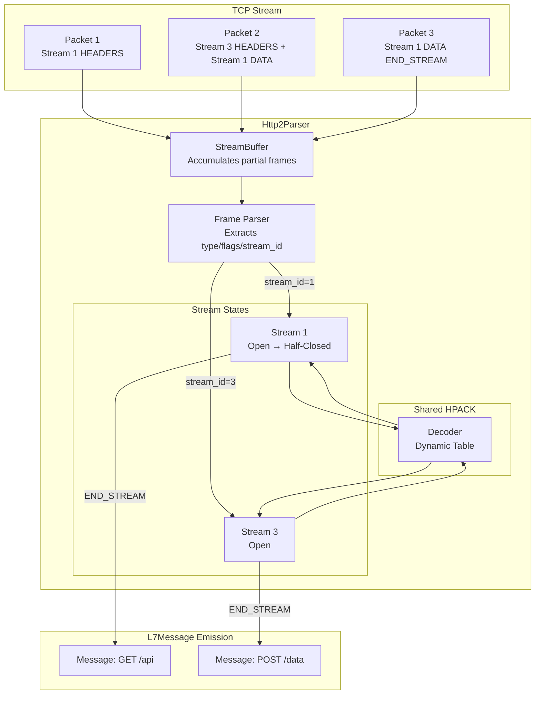
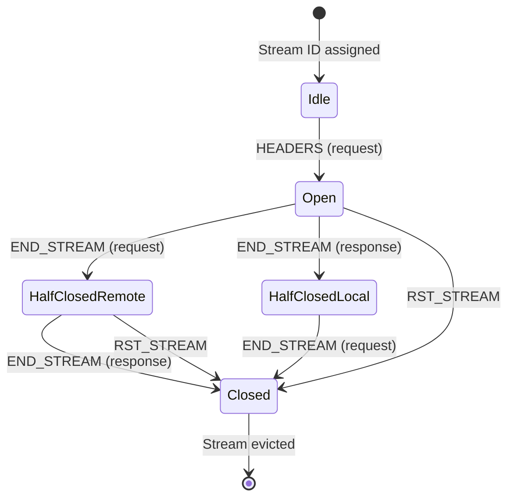
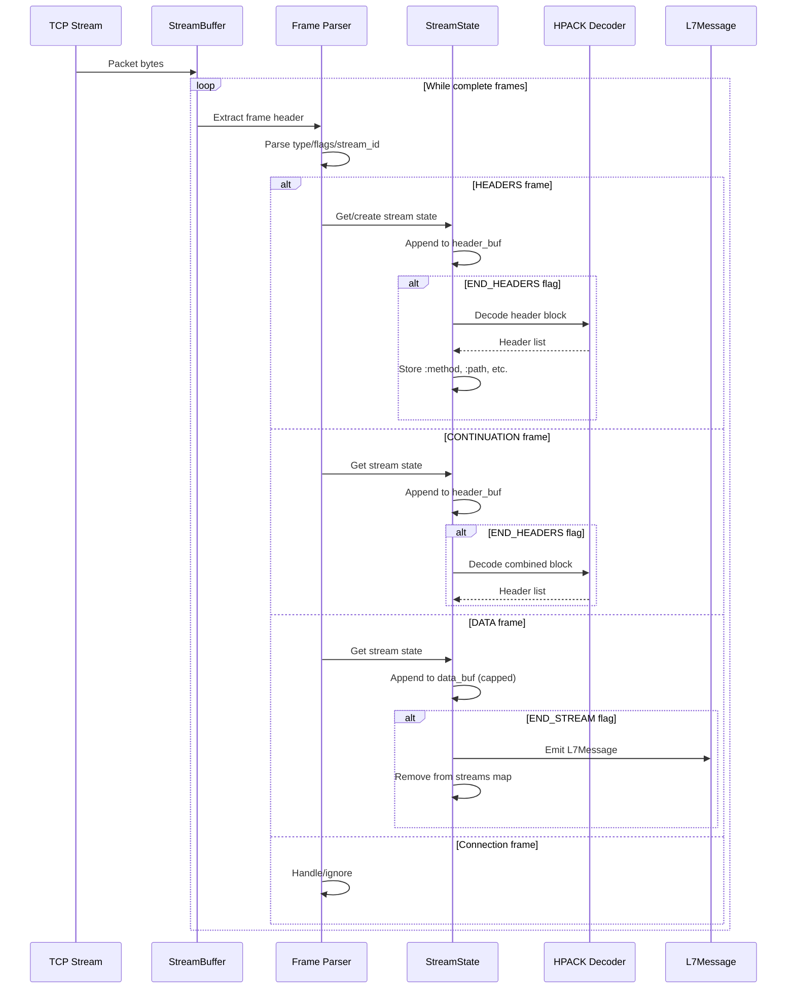
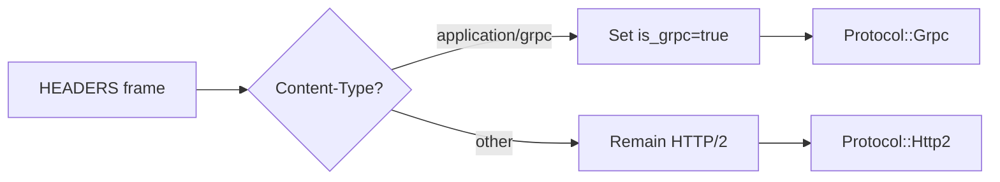

# ADR-004: HTTP/2 Stream Multiplexing Architecture

## Metadata

| Field | Value |
|-------|-------|
| **Status** | Accepted |
| **Date** | 2025-02-18 |
| **Decision Makers** | @harshitparikh |
| **Affected Components** | `panopticon-agent/src/protocol/http2.rs`, `panopticon-agent/src/protocol/grpc.rs` |
| **Supersedes** | N/A |
| **Superseded by** | N/A |

## Context

### The Problem

HTTP/2 fundamentally differs from HTTP/1.1 in how it handles requests over a single TCP connection. While HTTP/1.1 uses sequential request-response pairs (or pipelining with head-of-line blocking), HTTP/2 introduces **stream multiplexing**—multiple independent request-response exchanges interleaved over one connection.

This creates significant parsing challenges for a passive network observer:

1. **Interleaved frames**: A packet may contain partial frames from multiple streams. Stream 1's HEADERS, Stream 3's DATA, and Stream 5's HEADERS may arrive in any order within a single TCP segment.

2. **Per-stream state**: Each stream has independent lifecycle (Idle → Open → Half-Closed → Closed). Request headers arrive first, response headers later, data frames interspersed. All must be correlated.

3. **HPACK stateful compression**: Header compression uses a dynamic table shared across all streams on a connection. Decoding Stream 5's headers requires the table state from Streams 1-4's headers.

4. **CONTINUATION frames**: Large header blocks can span multiple frames (HEADERS + CONTINUATION*). The parser must buffer and concatenate before decoding.

5. **gRPC detection**: gRPC runs over HTTP/2 with a specific Content-Type. Detecting `application/grpc` mid-stream requires switching protocol classification.

### HTTP/2 Frame Structure

```
+-----------------------------------------------+
|                 Length (24)                   |
+---------------+---------------+---------------+
|   Type (8)    |   Flags (8)   |
+---------------+-------------------------------+
|R|                 Stream Identifier (31)      |
+================================================+
|                   Frame Payload (0...)        ...
+------------------------------------------------+
```

Every frame includes a stream identifier (except connection-level frames like SETTINGS, PING, GOAWAY). This is the key to demultiplexing.

### Requirements

| Requirement | Constraint |
|-------------|------------|
| Concurrent streams | Up to 2^31-1 per connection |
| Header block size | Up to 16KB (typical), 64KB (max) |
| Data buffering | 64KB per stream (for PII scanning) |
| HPACK dynamic table | 4096 bytes default, configurable |
| gRPC detection | Automatic on Content-Type match |

## Decision

We will use a **per-stream state machine** with a **shared HPACK decoder**, implemented as `Http2Parser` with `HashMap<u32, StreamState>` for stream tracking.

### Architecture Overview



### Core Components

#### 1. StreamState

Per-stream state tracking:

```rust
struct StreamState {
    method: Option<String>,
    path: Option<String>,
    status: Option<u32>,
    content_type: Option<String>,
    headers: Vec<(String, String)>,
    request_ts: Option<u64>,
    request_size: u64,
    response_size: u64,
    header_buf: Vec<u8>,
    is_request: bool,
    data_buf: Vec<u8>,
}
```

**Key fields:**
- `header_buf`: Accumulates CONTINUATION frame payloads until END_HEADERS flag
- `data_buf`: Stores up to 64KB of body data for PII scanning
- `is_request`: Distinguishes request HEADERS from response HEADERS

#### 2. Http2Parser

Connection-level parser with shared HPACK:

```rust
pub struct Http2Parser {
    buf: StreamBuffer,
    streams: HashMap<u32, StreamState>,
    decoder: hpack::Decoder<'static>,
    preface_seen: bool,
    is_grpc: bool,
    protocol_type: Protocol,
}
```

**Design choices:**
- **Single HPACK decoder**: Dynamic table is connection-scoped by spec
- **Lazy stream creation**: `streams.entry(stream_id).or_default()` on first frame
- **Protocol type switching**: `is_grpc` flag updates `protocol_type` on detection

#### 3. Frame Handling

| Frame Type | Value | Action |
|------------|-------|--------|
| DATA | 0x0 | Accumulate body, emit on END_STREAM |
| HEADERS | 0x1 | Buffer to `header_buf`, decode on END_HEADERS |
| SETTINGS | 0x4 | Skip (connection-level) |
| PING | 0x6 | Skip (connection-level) |
| GOAWAY | 0x7 | Mark connection closing |
| WINDOW_UPDATE | 0x8 | Skip (flow control) |
| CONTINUATION | 0x9 | Append to `header_buf` |

### Stream Lifecycle



**State transitions in practice:**

```
Stream 1 (request-response):
  Idle → Open         [HEADERS :method=GET :path=/api]
  Open → Half-Closed  [DATA + END_STREAM] (request body)
  Half-Closed → Closed [HEADERS :status=200 + END_STREAM]

Stream 3 (request-only, server push):
  Idle → Open         [HEADERS :method=GET :path=/push]
  Open → Half-Closed  [DATA + END_STREAM]
```

### Data Flow



### HPACK Handling

The `hpack` crate provides the decoder with dynamic table management:

```rust
fn try_decode_headers(&mut self, stream_id: u32, _flags: u8, _ts: u64) -> Option<L7Message> {
    let stream = self.streams.get_mut(&stream_id)?;
    let header_bytes = std::mem::take(&mut stream.header_buf);

    let decoded = self.decoder.decode(&header_bytes).ok()?;

    for (name, value) in &decoded {
        let name_str = String::from_utf8_lossy(name).to_lowercase();
        let value_str = String::from_utf8_lossy(value).into_owned();

        match name_str.as_str() {
            ":method" => stream.method = Some(value_str),
            ":path" => stream.path = Some(value_str),
            ":status" => stream.status = value_str.parse().ok(),
            "content-type" => {
                stream.content_type = Some(value_str.clone());
                if value_str.starts_with("application/grpc") {
                    self.is_grpc = true;
                    self.protocol_type = Protocol::Grpc;
                }
            }
            _ => {}
        }
        stream.headers.push((name_str, value_str));
    }
    None
}
```

**Key points:**
- Dynamic table state persists across streams (per RFC 7541)
- Header block concatenation handled before decode
- Pseudo-headers (`:method`, `:path`, `:status`) extracted for L7Message fields

### gRPC Integration

gRPC uses HTTP/2 framing with an additional 5-byte prefix per message:

```
+----------------------------------------+
| Compressed-Flag (1 byte) | 0 or 1     |
+----------------------------------------+
| Message-Length (4 bytes) | uint32 BE  |
+========================================+
| Message data (protobuf/json)           |
+----------------------------------------+
```

Detection flow:



When `Content-Type: application/grpc` is detected:
1. Set `self.is_grpc = true`
2. Update `self.protocol_type = Protocol::Grpc`
3. Parser continues HTTP/2 frame handling
4. L7Message emitted with `Protocol::Grpc`

## Consequences

### Positive

1. **Accurate stream demultiplexing**: Each stream tracked independently with correct state transitions. Interleaved frames handled correctly.

2. **Efficient HPACK**: Single decoder with shared dynamic table matches HTTP/2 spec. No duplicate table state per stream.

3. **Memory bounded**: Per-stream data buffer capped at 64KB. Large responses don't exhaust memory.

4. **gRPC transparency**: Protocol switch happens automatically on Content-Type detection. No separate parser needed.

5. **CONTINUATION support**: Large header blocks spanning multiple frames correctly concatenated and decoded.

### Negative

1. **Memory per stream**: Each active stream consumes ~8KB for StreamState. At 100 concurrent streams, ~800KB overhead per connection.

2. **HPACK table growth**: Malicious clients can send many unique headers to inflate dynamic table. Mitigated by default 4KB limit.

3. **No flow control**: Parser doesn't track WINDOW_UPDATE frames. Passive observer doesn't need to respect flow control, but missing data may cause parse errors.

### Neutral

1. **Frame ordering assumption**: Parser assumes frames arrive in TCP order (which they do). No reassembly buffer needed.

2. **Connection preface optional**: Parser handles connections with or without the HTTP/2 preface string (`PRI * HTTP/2.0...`).

## Alternatives Considered

### Alternative 1: Per-Stream HPACK Decoder

**Description**: Each StreamState has its own HPACK decoder instance.

**Pros**:
- Simplifies reasoning about decoder state
- Parallel decode possible

**Cons**:
- Violates HTTP/2 spec (dynamic table is connection-scoped)
- Duplicate table entries waste memory
- Incorrect decode if table not synchronized

**Why rejected**: HPACK dynamic table is explicitly connection-scoped in RFC 7541. Per-stream decoders would produce incorrect results.

### Alternative 2: Full Frame Reassembly

**Description**: Buffer all frames until connection closes, then parse entire stream.

**Pros**:
- Simpler state machine
- Can handle out-of-order delivery

**Cons**:
- Unbounded memory usage
- Infinite latency for long-lived connections
- Doesn't match real-time observability requirements

**Why rejected**: P99 latency target (< 5ms) precludes buffering entire connection.

### Alternative 3: Separate gRPC Parser

**Description**: Detect gRPC during protocol detection phase, use dedicated parser.

**Pros**:
- Cleaner separation of concerns
- gRPC-specific optimizations possible

**Cons**:
- gRPC detection requires inspecting HTTP/2 headers
- Duplicated frame parsing logic
- Protocol switch mid-stream complex

**Why rejected**: gRPC is HTTP/2 with protobuf framing. Reusing HTTP/2 parser with protocol type switch is simpler and correct.

## Implementation Notes

### Basic Usage

```rust
use panopticon_agent::protocol::{http2::Http2Parser, Direction, ProtocolParser};

let mut parser = Http2Parser::new(false);

for packet in packets {
    match parser.feed(&packet.data, Direction::Egress, packet.timestamp) {
        ParseResult::Messages(msgs) => {
            for msg in msgs {
                println!("Stream complete: {} {}", msg.method.unwrap_or_default(), msg.path.unwrap_or_default());
            }
        }
        ParseResult::NeedMoreData => continue,
        ParseResult::Error(e) => eprintln!("Parse error: {}", e),
    }
}
```

### Creating gRPC-Aware Parser

```rust
let mut grpc_parser = Http2Parser::new(true);
assert_eq!(grpc_parser.protocol(), Protocol::Grpc);
```

### Frame Construction Helper (Testing)

```rust
fn make_frame(frame_type: u8, flags: u8, stream_id: u32, payload: &[u8]) -> Vec<u8> {
    let len = payload.len();
    let mut f = Vec::with_capacity(9 + len);
    f.push((len >> 16) as u8);
    f.push((len >> 8) as u8);
    f.push(len as u8);
    f.push(frame_type);
    f.push(flags);
    let sid = stream_id.to_be_bytes();
    f.extend_from_slice(&sid);
    f.extend_from_slice(payload);
    f
}
```

### Handling Multiplexed Streams

```rust
#[test]
fn test_multiplexed_streams() {
    let mut parser = Http2Parser::new(false);
    
    // Stream 1: GET /a
    let h1 = encode_headers(&[(":method", "GET"), (":path", "/a")]);
    parser.feed(&make_frame(FRAME_HEADERS, FLAG_END_HEADERS, 1, &h1), ...);
    
    // Stream 3: POST /b (interleaved)
    let h3 = encode_headers(&[(":method", "POST"), (":path", "/b")]);
    parser.feed(&make_frame(FRAME_HEADERS, FLAG_END_HEADERS, 3, &h3), ...);
    
    // Complete both
    parser.feed(&make_frame(FRAME_DATA, FLAG_END_STREAM, 1, b""), ...);
    parser.feed(&make_frame(FRAME_DATA, FLAG_END_STREAM, 3, b"body"), ...);
    
    // Both messages emitted in single result
    assert_eq!(msgs.len(), 2);
}
```

### Integration with ConnectionFsmManager

```rust
impl ProtocolFsm for Http2Parser {
    fn process_packet(&mut self, _direction: Direction, data: &[u8], ts: u64) -> FsmResult {
        if self.buf.extend(data).is_err() {
            return FsmResult::Error("buffer overflow".into());
        }
        match self.process(ts) {
            ParseResult::NeedMoreData => FsmResult::WaitingForMore,
            ParseResult::Messages(msgs) if msgs.len() == 1 => {
                FsmResult::MessageComplete(msgs.into_iter().next().unwrap())
            }
            ParseResult::Messages(msgs) => FsmResult::Messages(msgs),
            ParseResult::Error(e) => FsmResult::Error(e),
        }
    }

    fn current_state(&self) -> &'static str {
        if self.preface_seen { "streaming" } else { "preface" }
    }

    fn protocol(&self) -> Protocol {
        self.protocol_type
    }

    fn reset_for_next_transaction(&mut self) {
        self.streams.clear();
        self.decoder = hpack::Decoder::new();
        self.preface_seen = false;
        self.buf.clear();
    }
}
```

## Performance Considerations

### Memory Usage (Per Connection)

| Component | Size | Count | Total |
|-----------|------|-------|-------|
| Http2Parser struct | ~100 bytes | 1 | 100 B |
| StreamState (avg) | ~8 KB | 10-100 | 80-800 KB |
| StreamBuffer | 64 KB | 1 | 64 KB |
| HPACK dynamic table | 4 KB | 1 | 4 KB |
| **Typical total** | — | — | **~150-870 KB** |

### Latency Breakdown

| Operation | P50 | P99 |
|-----------|-----|-----|
| Frame header parse | 50 ns | 100 ns |
| Stream lookup | 20 ns | 50 ns |
| HPACK decode (small) | 1 µs | 3 µs |
| HPACK decode (large) | 5 µs | 15 µs |
| Message emission | 100 ns | 200 ns |

### Optimization Tips

1. **Cap data_buf**: Limit to 64KB per stream to prevent memory exhaustion from large responses.

2. **Reuse header_buf**: Use `std::mem::take` to avoid allocation on each decode.

3. **Skip flow control**: WINDOW_UPDATE frames can be ignored—passive observer doesn't participate.

4. **Early gRPC detection**: Check Content-Type immediately on decode, not at message emission.

## References

- [RFC 7540: HTTP/2](https://www.rfc-editor.org/rfc/rfc7540)
- [RFC 7541: HPACK](https://www.rfc-editor.org/rfc/rfc7541)
- [gRPC over HTTP/2](https://github.com/grpc/grpc/blob/master/doc/PROTOCOL-HTTP2.md)
- [hpack crate documentation](https://docs.rs/hpack/latest/hpack/)
- `panopticon-agent/src/protocol/http2.rs` — Implementation
- ADR-001: ConnectionFsmManager Architecture

---

## Revision History

| Date | Author | Description |
|------|--------|-------------|
| 2025-02-18 | @harshitparikh | Initial proposal and acceptance |
