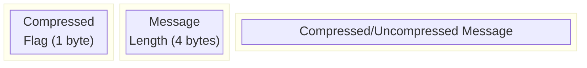
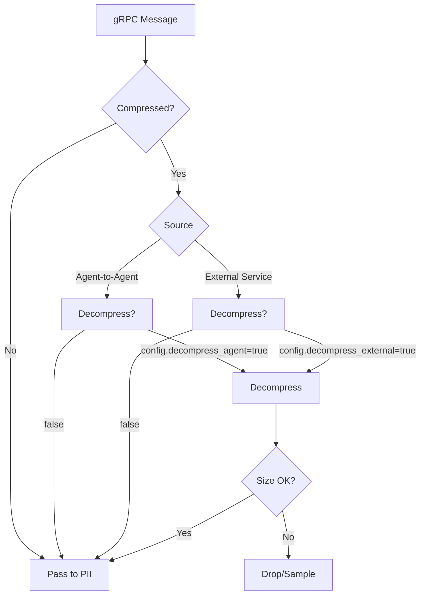
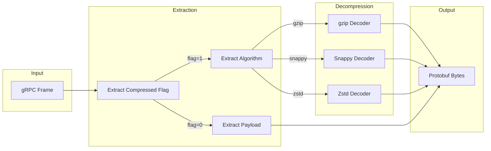
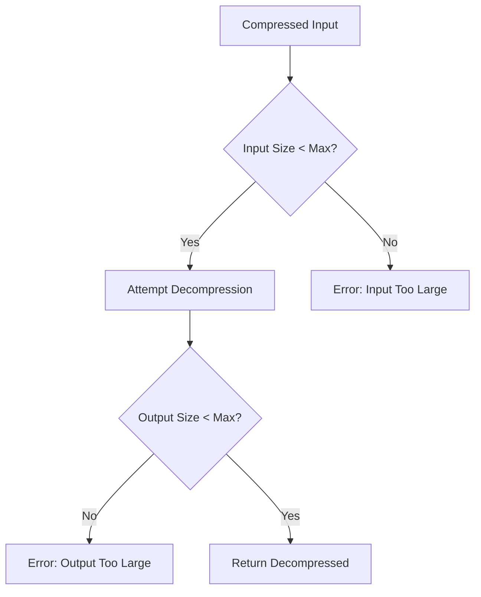
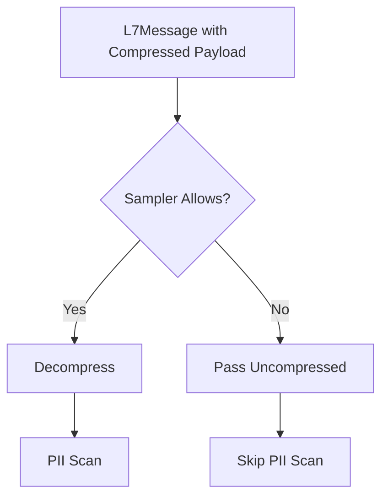

# Compression Handling

Documentation for decompressing gRPC and HTTP payloads before PII scanning.

## Overview

gRPC supports three compression algorithms:

| Algorithm | Codec | Wire Format |
|-----------|-------|-------------|
| **gzip** | `gzip` | RFC 1952 (DEFLATE with header) |
| **snappy** | `snappy` | Google Snappy block format |
| **zstd** | `zstd` | Zstandard frame format |

Compression is negotiated via `grpc-accept-encoding` header and indicated per-message by the gRPC frame's `compressed_flag` byte.

## gRPC Frame Format



| Field | Size | Description |
|-------|------|-------------|
| `compressed_flag` | 1 byte | `0` = uncompressed, `1` = compressed |
| `message_length` | 4 bytes | Big-endian length of message (after decompression if applicable) |
| `message` | N bytes | Protobuf payload |

## Configuration

### DecompressionConfig

```rust
pub struct DecompressionConfig {
    /// Enable decompression for agent-to-agent traffic
    pub decompress_agent: bool,
    
    /// Enable decompression for external service traffic
    pub decompress_external: bool,
    
    /// Maximum decompressed size (bytes)
    pub max_decompressed_size: usize,
    
    /// Supported algorithms
    pub enabled_algorithms: Vec<CompressionAlgorithm>,
}

#[derive(Debug, Clone, Copy, PartialEq, Eq)]
pub enum CompressionAlgorithm {
    Gzip,
    Snappy,
    Zstd,
}

impl Default for DecompressionConfig {
    fn default() -> Self {
        Self {
            decompress_agent: true,
            decompress_external: false, // Conservative default
            max_decompressed_size: 10 * 1024 * 1024, // 10MB
            enabled_algorithms: vec![
                CompressionAlgorithm::Gzip,
                CompressionAlgorithm::Snappy,
            ],
        }
    }
}
```

### Agent vs External Service

Different decompression policies based on traffic source:



**Rationale:**

- **Agent traffic** is trusted, safe to decompress
- **External traffic** may contain zip bombs or malicious payloads
- Conservative defaults prioritize security over observability

## Decompression Pipeline

### Pipeline Architecture



### Implementation Sketch

```rust
use flate2::read::GzDecoder;
use snap::read::FrameDecoder;
use zstd::stream::read::Decoder as ZstdDecoder;

pub fn decompress(
    data: &[u8],
    algorithm: CompressionAlgorithm,
    config: &DecompressionConfig,
) -> Result<Vec<u8>, DecompressionError> {
    // Size limit check before decompression
    if data.len() > config.max_decompressed_size {
        return Err(DecompressionError::InputTooLarge);
    }
    
    let mut output = Vec::new();
    
    match algorithm {
        CompressionAlgorithm::Gzip => {
            let mut decoder = GzDecoder::new(data);
            decoder.take(config.max_decompressed_size as u64)
                .read_to_end(&mut output)?;
        }
        CompressionAlgorithm::Snappy => {
            let mut decoder = FrameDecoder::new(data);
            decoder.take(config.max_decompressed_size as u64)
                .read_to_end(&mut output)?;
        }
        CompressionAlgorithm::Zstd => {
            let decoder = ZstdDecoder::new(data)?;
            decoder.take(config.max_decompressed_size as u64)
                .read_to_end(&mut output)?;
        }
    }
    
    Ok(output)
}
```

## Panic Handling

Decompression libraries can panic on malformed input. Use `catch_unwind` to prevent agent crashes:

```rust
use std::panic::{catch_unwind, AssertUnwindSafe};

pub fn safe_decompress(
    data: &[u8],
    algorithm: CompressionAlgorithm,
    config: &DecompressionConfig,
) -> Result<Option<Vec<u8>>, DecompressionError> {
    let config = config.clone();
    let data = data.to_vec();
    
    let result = catch_unwind(AssertUnwindSafe(|| {
        decompress(&data, algorithm, &config)
    }));
    
    match result {
        Ok(Ok(decompressed)) => Ok(Some(decompressed)),
        Ok(Err(e)) => Err(e),
        Err(_) => {
            tracing::warn!("Decompression panicked, skipping message");
            Ok(None)
        }
    }
}
```

### Error Types

```rust
#[derive(Debug, thiserror::Error)]
pub enum DecompressionError {
    #[error("input exceeds maximum allowed size")]
    InputTooLarge,
    
    #[error("output exceeds maximum allowed size")]
    OutputTooLarge,
    
    #[error("decompression failed: {0}")]
    DecompressionFailed(String),
    
    #[error("unsupported compression algorithm")]
    UnsupportedAlgorithm,
}
```

## Size Limits (Zip Bomb Prevention)

### Protection Strategy



### Implementation Details

1. **Pre-decompression check:** Verify compressed size < `max_decompressed_size`
2. **Streaming limit:** Use `take(max_decompressed_size)` on decoder
3. **Truncation detection:** If `read_to_end` hits limit, return error

```rust
impl DecompressionConfig {
    /// Validate and decompress with size limits.
    pub fn safe_decompress(&self, data: &[u8], algorithm: CompressionAlgorithm) 
        -> Result<Vec<u8>, DecompressionError> 
    {
        // Pre-check: don't even try on huge compressed payloads
        if data.len() > self.max_decompressed_size {
            return Err(DecompressionError::InputTooLarge);
        }
        
        let mut output = Vec::with_capacity(data.len() * 2); // Heuristic
        let limit = self.max_decompressed_size as u64;
        
        let bytes_read = match algorithm {
            CompressionAlgorithm::Gzip => {
                GzDecoder::new(data).take(limit).read_to_end(&mut output)?
            }
            // ... other algorithms
        };
        
        // Verify we didn't hit the limit mid-stream
        if output.len() >= self.max_decompressed_size {
            return Err(DecompressionError::OutputTooLarge);
        }
        
        Ok(output)
    }
}
```

## PII Sampling Integration

Decompression is expensive. Integrate with the inference sampler to budget decompression operations:



### Integration with InferenceSampler

```rust
impl PiiEngine {
    pub fn scan_message(&self, msg: &mut L7Message) -> Option<PiiReport> {
        let payload = msg.payload_text.as_ref()?;
        
        // Check if decompression is needed and budget allows
        if msg.is_compressed && self.sampler.should_decompress(msg) {
            match safe_decompress(payload.as_bytes(), msg.compression_algorithm, &self.config.decompression) {
                Ok(Some(decompressed)) => {
                    // Update payload with decompressed content
                    msg.payload_text = String::from_utf8(decompressed).ok();
                }
                Ok(None) => return None, // Panic during decompression
                Err(e) => {
                    tracing::debug!("Decompression failed: {}", e);
                    return None;
                }
            }
        }
        
        self.scan(msg.payload_text.as_ref()?)
    }
}
```

### Sampler Extension

```rust
impl InferenceSampler {
    /// Check if decompression budget allows this message.
    pub fn should_decompress(&self, msg: &L7Message) -> bool {
        // Priority based on:
        // 1. First-seen for this (service, method) pair
        // 2. Agent traffic over external traffic
        // 3. Recent budget availability
        
        let budget = self.decompress_budget.load(Ordering::Relaxed);
        budget > 0
    }
    
    /// Consume decompression budget.
    pub fn consume_decompress(&self, estimated_size: usize) {
        self.decompress_budget.fetch_sub(1, Ordering::Relaxed);
    }
}
```

## Algorithm Detection

Compression algorithm is determined from:

1. **gRPC header:** `grpc-encoding` response header
2. **Message flag:** `compressed_flag` byte in frame

```rust
pub fn detect_compression(headers: &[(String, String)], compressed_flag: bool) 
    -> Option<CompressionAlgorithm> 
{
    if !compressed_flag {
        return None;
    }
    
    headers.iter()
        .find(|(name, _)| name.to_lowercase() == "grpc-encoding")
        .and_then(|(_, value)| match value.to_lowercase().as_str() {
            "gzip" => Some(CompressionAlgorithm::Gzip),
            "snappy" => Some(CompressionAlgorithm::Snappy),
            "zstd" => Some(CompressionAlgorithm::Zstd),
            _ => None,
        })
}
```

## Dependencies

Add to `Cargo.toml`:

```toml
[dependencies]
flate2 = "1.0"
snap = "1.1"
zstd = "0.13"
```

## Performance Characteristics

| Algorithm | Decompression Speed | Compression Ratio | Use Case |
|-----------|---------------------|-------------------|----------|
| gzip | ~100 MB/s | 2.5:1 | General purpose |
| snappy | ~500 MB/s | 1.5:1 | Low-latency services |
| zstd | ~400 MB/s | 3:1 | High-compression needs |

**Recommendations:**

- Enable `snappy` for agent-to-agent traffic (fastest)
- Enable `gzip` for external traffic (widest compatibility)
- Enable `zstd` only if services use it

## Related Documentation

- [Protocol Parsing Overview](./README.md)
- [ADR-005: gRPC Compression Handling](../adr/ADR-005-grpc-compression.md)
- [PII Detection Pipeline](../pii/README.md) (planned)
