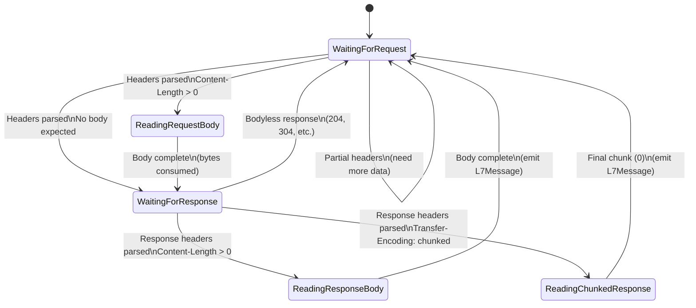
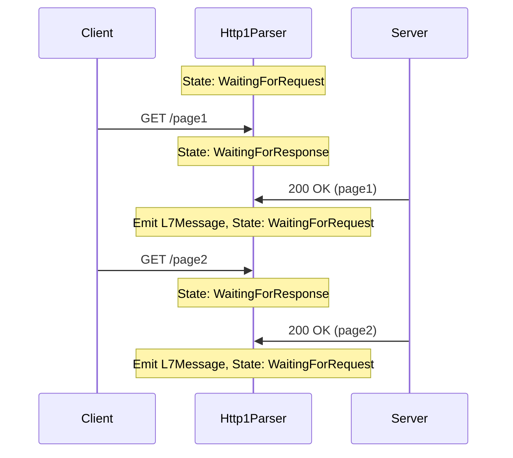
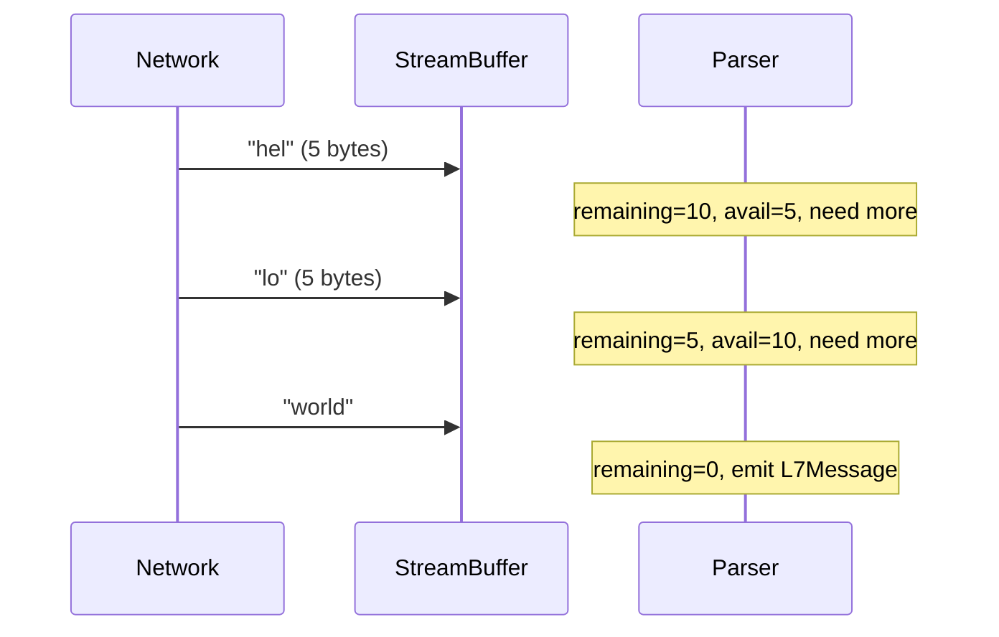

# HTTP/1.1 Parser

FSM-based HTTP/1.1 protocol parser with Keep-Alive and chunked transfer-encoding support.

## State Machine



## States

| State | Description | Entry Condition |
|-------|-------------|-----------------|
| `WaitingForRequest` | Initial state, awaiting client request | Start, after response complete |
| `ReadingRequestBody` | Accumulating request body bytes | `Content-Length > 0` in request |
| `WaitingForResponse` | Request complete, awaiting server response | Body consumed or bodyless request |
| `ReadingResponseBody` | Accumulating response body | `Content-Length > 0` in response |
| `ReadingChunkedResponse` | Reading chunked transfer-encoding | `Transfer-Encoding: chunked` |

## Implementation

### Parser Structure

```rust
pub struct Http1Parser {
    state: State,
    client_buf: StreamBuffer,    // Request data (Egress direction)
    server_buf: StreamBuffer,    // Response data (Ingress direction)
    pending_request: Option<PendingRequest>,
    response_body: Vec<u8>,
    response_headers: Vec<(String, String)>,
    response_status: Option<u32>,
    response_content_type: Option<String>,
}

struct PendingRequest {
    method: String,
    path: String,
    timestamp_ns: u64,
    request_size: u64,
    headers: Vec<(String, String)>,
}
```

### Processing Loop

The parser uses a tight processing loop to handle multiple messages from a single `feed()` call:

```rust
fn process(&mut self, timestamp_ns: u64) -> ParseResult {
    let mut messages = Vec::new();
    
    loop {
        match self.state.clone() {
            State::WaitingForRequest => {
                if !self.try_parse_request(timestamp_ns) {
                    break; // Need more data
                }
            }
            State::ReadingRequestBody { remaining } => {
                // Consume body bytes, transition when complete
            }
            State::WaitingForResponse => {
                if !self.try_parse_response(timestamp_ns) {
                    break;
                }
            }
            State::ReadingResponseBody { remaining } => {
                // Accumulate body, emit message when complete
            }
            State::ReadingChunkedResponse => {
                // Parse chunk boundaries
            }
        }
    }
    
    if messages.is_empty() {
        ParseResult::NeedMoreData
    } else {
        ParseResult::Messages(messages)
    }
}
```

## Keep-Alive Handling

HTTP Keep-Alive allows multiple request/response pairs on a single TCP connection:



**Implementation:**

```rust
fn reset_for_next_transaction(&mut self) {
    self.state = State::WaitingForRequest;
    self.pending_request = None;
    self.response_body.clear();
    self.response_headers.clear();
    self.response_status = None;
    self.response_content_type = None;
}
```

The parser automatically resets after emitting an `L7Message`, ready for the next transaction.

## Chunked Transfer-Encoding

For responses with `Transfer-Encoding: chunked`, the parser reads chunk size lines:

```http
HTTP/1.1 200 OK
Transfer-Encoding: chunked

5\r\n
hello\r\n
6\r\n
 world\r\n
0\r\n
\r\n
```

### Chunk Parsing Algorithm

```rust
fn read_chunked_body(&mut self) -> ChunkResult {
    loop {
        let data = self.server_buf.data();
        if data.is_empty() {
            return ChunkResult::NeedMoreData;
        }
        
        // Find chunk size line (hex + CRLF)
        let crlf_pos = match data.windows(2).position(|w| w == b"\r\n") {
            Some(pos) => pos,
            None => return ChunkResult::NeedMoreData,
        };
        
        let chunk_size = usize::from_str_radix(size_str, 16)?;
        
        // Last chunk (size=0) signals end
        if chunk_size == 0 {
            return ChunkResult::Complete;
        }
        
        // Verify we have: size_line + chunk_data + trailing CRLF
        let total = crlf_pos + 2 + chunk_size + 2;
        if data.len() < total {
            return ChunkResult::NeedMoreData;
        }
        
        // Append to response body
        self.response_body.extend_from_slice(&data[..chunk_size]);
        self.server_buf.consume(total);
    }
}
```

## Multi-Packet Handling

Real network traffic splits requests/responses across multiple TCP packets:

### Split Headers

```
Packet 1: "GET /test HTTP/1.1\r\nHo"
Packet 2: "st: example.com\r\n\r\n"
```

The parser accumulates partial data in `StreamBuffer` until `httparse` returns `Status::Complete`.

### Split Body

```
Packet 1: Headers + "hel"
Packet 2: "lo"
Packet 3: "world" (if Content-Length: 10)
```

The `ReadingResponseBody` state tracks `remaining` bytes and consumes incrementally.



## Latency Calculation

Latency is computed from request timestamp to response timestamp:

```rust
fn emit_message(&self, timestamp_ns: u64) -> Option<L7Message> {
    let req = self.pending_request.as_ref()?;
    let mut msg = L7Message::new(Protocol::Http1, Direction::Ingress, timestamp_ns);
    
    msg.latency_ns = Some(timestamp_ns.saturating_sub(req.timestamp_ns));
    // ...
}
```

**Note:** This measures application-level latency (request→response), not RTT.

## Bodyless Responses

HTTP defines status codes that never have a body:

- `204 No Content`
- `304 Not Modified`
- Responses to `HEAD` requests
- `1xx` informational responses

These transition directly from `WaitingForResponse` → `WaitingForRequest`:

```rust
fn try_parse_response(&mut self, _timestamp_ns: u64) -> bool {
    // ... parse headers ...
    
    if is_chunked {
        self.state = State::ReadingChunkedResponse;
    } else if let Some(body_len) = content_length {
        if body_len > 0 {
            self.state = State::ReadingResponseBody { remaining: body_len };
        } else {
            self.state = State::WaitingForRequest; // No body
            return true;
        }
    } else {
        self.state = State::WaitingForRequest; // No Content-Length
        return true;
    }
}
```

## Code Examples

### Basic GET Request

```rust
use panopticon_agent::protocol::{Http1Parser, ProtocolParser, Direction, ParseResult};

let mut parser = Http1Parser::new();

// Client request
let req = b"GET /api/users HTTP/1.1\r\nHost: api.example.com\r\n\r\n";
let result = parser.feed(req, Direction::Egress, 1000);
assert!(matches!(result, ParseResult::NeedMoreData));
assert_eq!(parser.state_name(), "waiting_for_response");

// Server response
let resp = b"HTTP/1.1 200 OK\r\nContent-Length: 2\r\n\r\n[]";
let result = parser.feed(resp, Direction::Ingress, 2500);

match result {
    ParseResult::Messages(msgs) => {
        assert_eq!(msgs.len(), 1);
        assert_eq!(msgs[0].method.as_deref(), Some("GET"));
        assert_eq!(msgs[0].path.as_deref(), Some("/api/users"));
        assert_eq!(msgs[0].status, Some(200));
        assert_eq!(msgs[0].latency_ns, Some(1500)); // 2500 - 1000
        assert_eq!(msgs[0].payload_text.as_deref(), Some("[]"));
    }
    _ => panic!("Expected Messages"),
}
```

### POST with Request Body

```rust
let mut parser = Http1Parser::new();

let req = b"POST /api/users HTTP/1.1\r\n\
            Host: api.example.com\r\n\
            Content-Type: application/json\r\n\
            Content-Length: 21\r\n\r\n\
            {\"name\":\"Alice\"}";
parser.feed(req, Direction::Egress, 1000);
assert_eq!(parser.state_name(), "waiting_for_response");

let resp = b"HTTP/1.1 201 Created\r\n\
             Content-Length: 10\r\n\r\n\
             {\"id\": 123}";
let result = parser.feed(resp, Direction::Ingress, 2000);

// Verify L7Message emitted
```

### Chunked Response

```rust
let mut parser = Http1Parser::new();

let req = b"GET /stream HTTP/1.1\r\nHost: example.com\r\n\r\n";
parser.feed(req, Direction::Egress, 1000);

let resp = b"HTTP/1.1 200 OK\r\n\
             Transfer-Encoding: chunked\r\n\r\n\
             5\r\nhello\r\n\
             6\r\n world\r\n\
             0\r\n\r\n";
             
let result = parser.feed(resp, Direction::Ingress, 2000);

match result {
    ParseResult::Messages(msgs) => {
        assert_eq!(msgs[0].payload_text.as_deref(), Some("hello world"));
    }
    _ => panic!("Expected Messages"),
}
```

### Multi-Packet Request

```rust
let mut parser = Http1Parser::new();

// First packet: partial headers
let p1 = b"GET /test HTTP/1.1\r\nHo";
let result = parser.feed(p1, Direction::Egress, 1000);
assert!(matches!(result, ParseResult::NeedMoreData));

// Second packet: rest of headers
let p2 = b"st: example.com\r\n\r\n";
let result = parser.feed(p2, Direction::Egress, 1000);
assert!(matches!(result, ParseResult::NeedMoreData));
assert_eq!(parser.state_name(), "waiting_for_response");
```

### Keep-Alive Multiple Requests

```rust
let mut parser = Http1Parser::new();

// First transaction
parser.feed(b"GET /page1 HTTP/1.1\r\nHost: x\r\n\r\n", Direction::Egress, 1000);
let result = parser.feed(b"HTTP/1.1 200 OK\r\nContent-Length: 4\r\n\r\npage", Direction::Ingress, 2000);
assert!(matches!(result, ParseResult::Messages(_)));
assert_eq!(parser.state_name(), "waiting_for_request");

// Second transaction (same connection)
parser.feed(b"GET /page2 HTTP/1.1\r\nHost: x\r\n\r\n", Direction::Egress, 3000);
let result = parser.feed(b"HTTP/1.1 200 OK\r\nContent-Length: 5\r\n\r\npage2", Direction::Ingress, 4000);

match result {
    ParseResult::Messages(msgs) => {
        assert_eq!(msgs[0].path.as_deref(), Some("/page2"));
        assert_eq!(msgs[0].latency_ns, Some(1000)); // 4000 - 3000
    }
    _ => panic!("Expected Messages"),
}
```

## Performance Notes

- **Zero-copy header parsing** via `httparse` crate
- **Per-direction buffers** avoid mixing client/server data
- **64KB payload cap** for PII scanning (truncates large responses)
- **256KB buffer max** prevents memory exhaustion

## Related Documentation

- [Protocol Parsing Overview](./README.md)
- [ADR-002: Protocol Parser Lifecycle](../adr/ADR-002-protocol-lifecycle.md)
- [HTTP/2 Parser](./http2.md) (planned)
